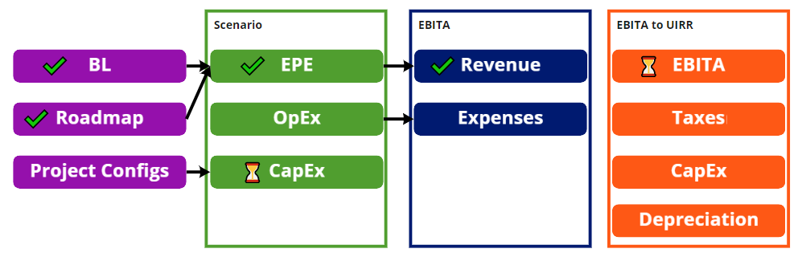
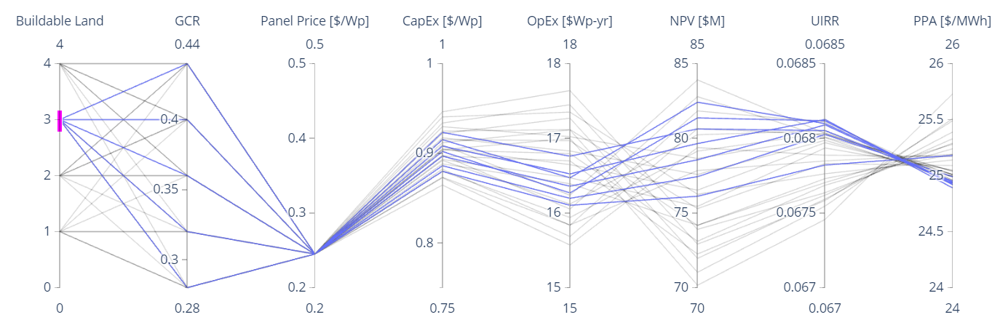

# EBITA Calculator

## Change History
2021-08-20 Initial draft

## Overview
The business has agreed that we need an automated proforma so that we can answer developer questions about project economics quickly. It is also assumed this will also alleviate the workload on the V&A team by reducing the amount of scenarios being sent to V&A by development. This is in support of the ultimate goal of optimizing solar projects so that EDF is competitive in the market place and able to scale our project pipeline to meet our CAP 2030 goals. The first step in building this capability is returning an EBITA calculation for an existing costing scenario. 

## Objectives
Solaris will return the same earnings before interest, taxes, and depreciation (EBITA) calculation as the full V&A model for a given set of manually uploaded monthly revenues, expenses and letter of credit fees. This will demonstrate the first step in an automated proforma that can be used by anyone in the business. 

## Success Metrics
Zero difference between a Solaris calculation and the Excel-based V&A model.

## Messaging
_Tentative_: You can trust the results of Solaris because its a reverse-engineered copy of the V&A model. 

## Timeline / Release Plan
Prototype released 2021-10-01 (End of third BOS)

## User Personas
PO - Cory or a Python SME as this is a prototype backend.

## Features In
Calculate EBITA from existing monthly Expenses and Revenue.

Expenses includes:
- Property Tax
- G&A
- O&M
- Leases and royalties

Revenue include:
- PPA
- Merchant
- RECs

## Features Out
- Front end
- UIRR
- Basis
- CapEx
- Taxes

## Designs
Jupyter notebook or simple Streamlit app. 

'North Star Prototype':

## Open Issues
Finalizing exact messaging. 

## Q&A

## Other Considerations
